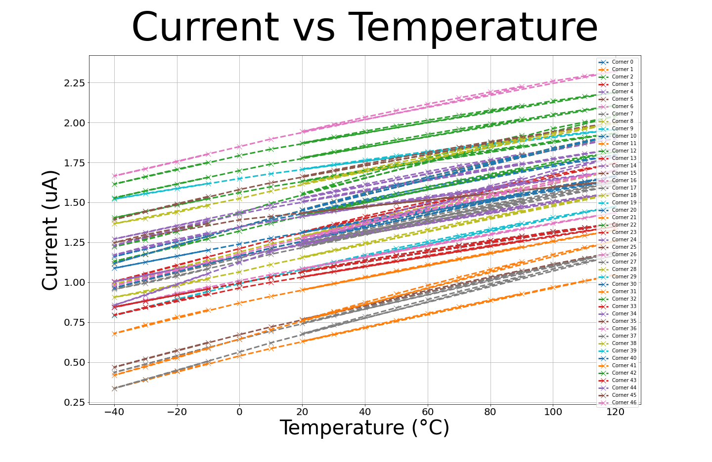
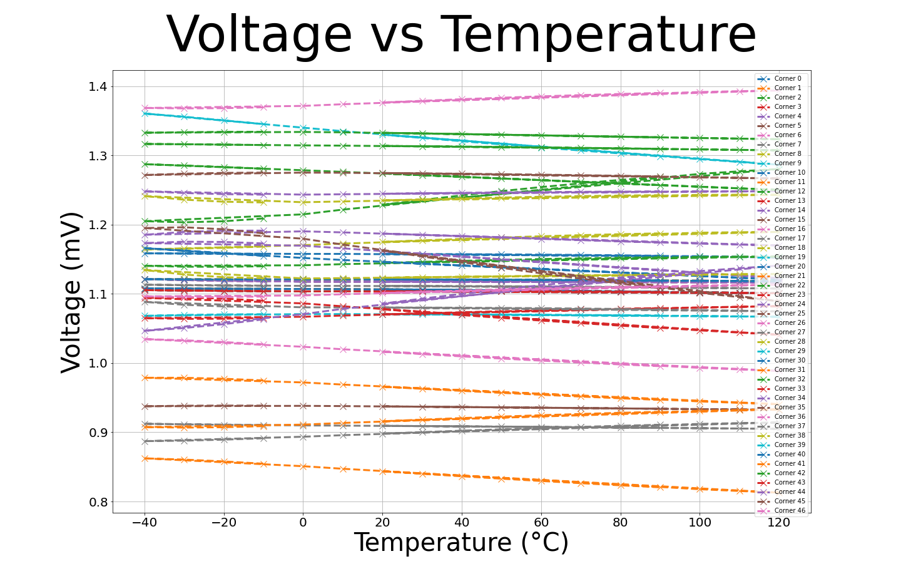
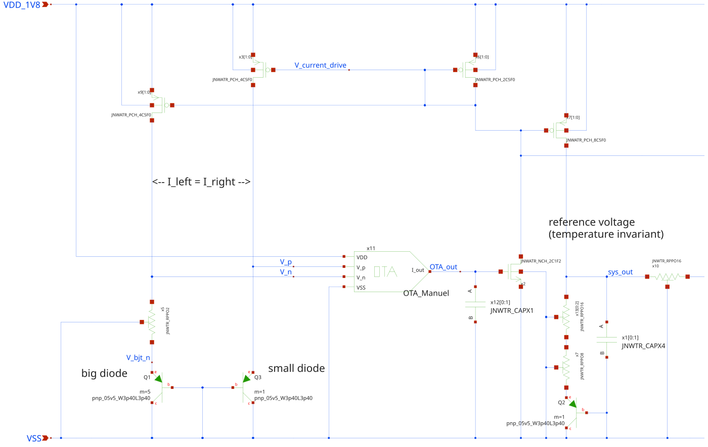
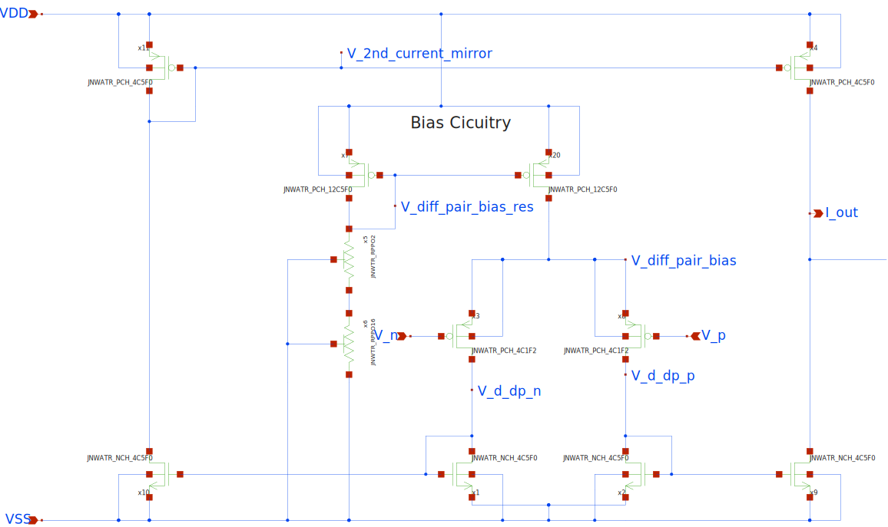
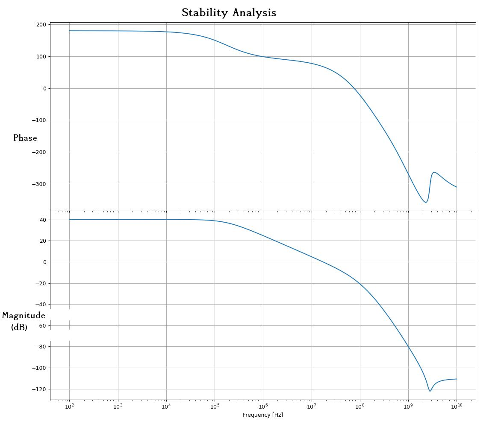
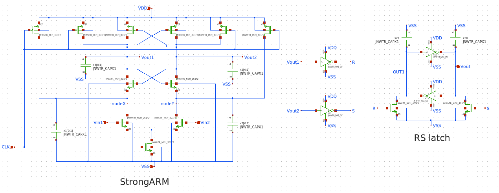
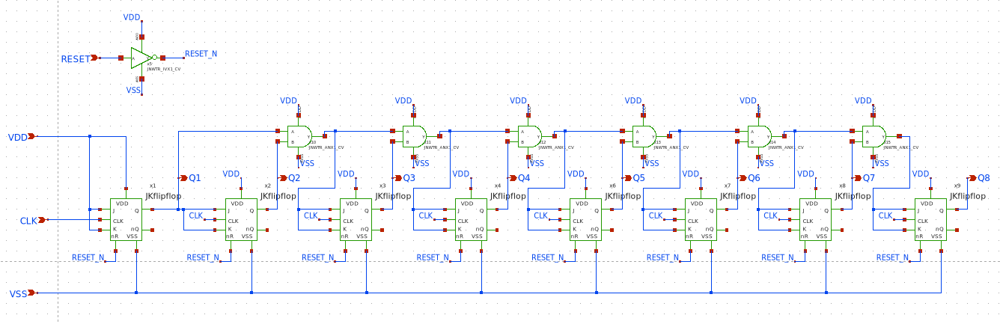
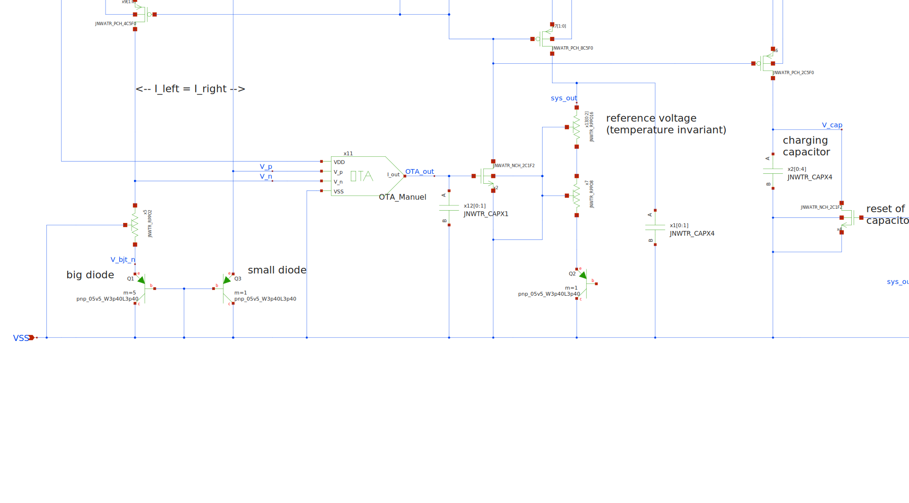

# Who
Group 05 (Manuel,Emilien,Amir,Fabrice)

# Why
We want to bake. Thus, we somehow have to measure the temperature in the oven --> There is a need for a temperature sensor.
This module creates an output current (almost linearly) dependent on the present temperature.

# What

| What            |        Cell/Name |
| :-              |  :-:       |
| Schematic       | design/JNW_GR05_SKY130A/JNW_GR05.sch |
| Layout          | design/JNW_GR05_SKY130A/JNW_GR05.mag |

# Changelog/Plan

| Version | Status | Comment|
| :---| :---| :---|
|0.1.0 | :Approved: | Fulfills the criterions for milestone 01 |
|1.0.0 | :Under Inspection: | Submission for milestone 02 |

# Signal interface

| Signal       | Direction | Domain  | Description                               |
| :---         | :---:     | :---:   | :---                                      |
| VDD_1V8         | Input     | VDD_1V8 | Main supply                              |
| VSS         | Input     | Ground  |                                           |
| PWRUP_1V8     | Input    | VDD_1V8 | Power up the circuit  (not implemented yet)                     |
| CLK | Input | System clock, could also be taken from on-chip clock source | 
| RESET | Input | Resets the internal 8 bit counter |
|Q1...Q7    | Output    | 8 bit output vector, straight binary |

# Key parameters

| Parameter           | Min     | Typ           | Max     | Unit  |
| :---                | :---:     | :---:           | :---:     | :---: |
| Technology          |         | Skywater 130 nm |         |       |
| AVDD                | 1.7    | 1.8           | 1.9    | V     |
| Temperature         | -40     | 27            | 125     | C     |

A output for a (take the word!) typical simulation is given by the following figure.
It shows the temperature-dependent output current which is fed into the capacitor on the right hand side
and the reference voltage used for the comparator on the right hand side.

Running for corners yields a similar but less consistent result (see below).
CAUTION: This is the first corner results, obtained on March 13. No steps taken yet to make it more consistent.
Output current:

Reference voltage:

# Description of the individual blocks
## About the time-dependent current
* Observe temperature-dependency in the diode equation
* Take two  Bipolar-Transistors (BJTs) with different cross-sectional area and make them diode-connected.
* Source a not necessarily identical current through both BJTs, but have the ratio fixed. The current ratio is not allowed to cancel the cross-sectional area ratio.
* Add a resistor in series to the wider BJT, BJT remains connected to ground.
* Connect the top terminal of the resistor and the terminal of the BJT to the input of an Operational-Transconductance-Amplifier (OTA)
* Connect the output of the OTA to a Common-Source amplifier whose output current is mirrored back into the BJTs.

Now, the inputs of the OTA are equal, and a temperature dependent voltage across the resistor is generated based on the difference in the base-emitter voltage of two different BJTs.
Thus, the current sourced into the BJTs is also linearly dependent in temperature - as desired.
The general structure is shown in this sketch:

## About the reference voltage:
The temperature-dependent current is mirrored into a resistor connected in series to another diode-connected BJT. The temperature dependency cancels or at least counteracts for a proper choice of the series resistance. Thus, a local temperature-invariant voltage is created which will be used as a reference. The voltage reference is also shown in the plot above.
## About the OTA:
The OTA is used to force the terminal of the smaller BJT to the voltage on the terminal of the resistor connected in series to the bigger BJT.
It consists of a differential pair followed by a current-mirror stage.
Since the voltage at the OTA inputs is basically a diode voltage, the inputs are close to the threshold voltage of the NMOS. Thus, PMOSes are used for the input pair.
The figure below presents the OTA schematic. Further down, a stability analysis of the OTA is used to check for a stable system.

## OTA Analysis

#### Results for RT are:
| Parameter  | Value      | Unit           | Description               |
|------------|------------|----------------|---------------------------|
| f3db       | 175.57     | kHz            | 3 dB Bandwidth           |
| gm_db      | -16.309    | dB             | Gain Margin               |
| lf_gain    | 40.073     | dB             | Low-Frequency Gain        |
| pm_deg     | 67.513     | Degrees        | Phase Margin              |
| ug         | 17.257     | MHz            | Unity Gain Frequency      |

Most importantly, the OTA is stable and meets the typical 40 dB DC gain for two-stage systems.
Further, the parameters indicate a rather low 3dB bandwidth and low unity gain frequency.
In physical systems, temperature increases or decreasses with a (compared to the OTA paramters) large time constant, 
thus we see no need for adapting the amplifier design.

#### Obtained bodeplot:

## About the comparator:
The comparator detects when the capacitor voltage exceeds the reference voltage. It is a StrongARM latch, as described in an article by Behzad Razavi.

Its operation consists of two phases, controlled by a clock signal:

* Pre-charge Phase: When the clock is low, the internal nodes (outputs and intermediate nodes) are pre-charged to VDD.
* Evaluation Phase: When the clock goes high, the input transistors compare the differential input voltages. If one input is higher than the other, a positive feedback mechanism rapidly drives the outputs to opposite logic levels, generating a strong digital output (high or low).
Since the comparator produces a valid output only half of the time (due to the pre-charge phase), its output is connected to an RS latch to maintain a stable signal.
The schematic of this comparator can be seen on the next figure.

link to Behzad Razavi's article : https://www.seas.ucla.edu/brweb/papers/Journals/BR_Magzine4.pdf

## About the counter:
Our objective is to count how many times the capacitor can charge within a given time period. To achieve this, we use a synchronous counter made of JK flip-flops.

In this counter, all flip-flops share the same clock signal, eliminating the delays found in asynchronous counters. The J and K inputs of each flip-flop are controlled by an AND gate, which takes the input and output of the previous flip-flop. This setup allows the counter to increment in binary.

Additionally, a reset input ensures that all flip-flops in the counter can be reset simultaneously.
The schematic of the 8 bits counter is shown in the figure below.

## About the digital output proportional to temperature
The idea is to count how many times the capacitor charges and discharges within a certain period. To do this, the comparator checks if the capacitor's voltage is higher than a reference voltage. When this happens, the comparator output goes high, which then activates a transistor to discharge the capacitor. As a result, the output is a pulse signal that goes high every time the capacitor voltage crosses the reference.

A counter records these pulses. Counting how many times the capacitor charges and discharges gives more precision than just measuring how long it takes for one charge cycle. The longer we count, the higher the accuracy.

Currently, we count for 590.59 μs. Within this time, there is a difference of 160 pulses between the lowest temperature (-40°C) and the highest (120°C). This means each additional pulse corresponds to 1°C if the response is perfectly linear, leading to an accuracy of ±1°C.

A reset signal sets the measurement duration. In this case, it must be a pulse signal that activates every 590.59 μs. However, since our counter can only go up to 256, and the number of pulses can range from 295 (at -40°C) to 455 (at 120°C), an overflow will occur. This is not a problem because there will always be only one overflow, regardless of the temperature.

To determine the temperature, we will convert the counter’s binary output to a decimal number and apply an offset to get the correct temperature value.

## For completeness: View of the entire Top-Level design

The end.
