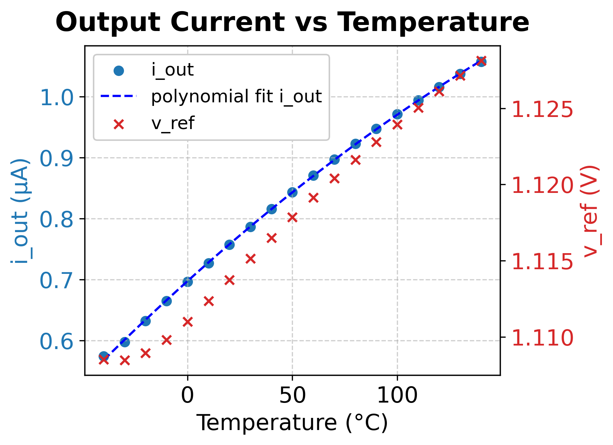

# Who
Group 04 (Manuel,Emilien,Amir,Fabrice)

# Why

This module creates an output current (almost linearly) dependent on the present temperatutre.

# How

Observe temperature-dependency in the diode equation, and use that to create a temperature dependent voltage based on the difference in the base-emitter voltage of two different BJTs.
Caution: The plot you find at the bottom of this page is as of now just a local upload, might be included into the github actions at a later point.

# What

| What            |        Cell/Name |
| :-              |  :-:       |
| Schematic       | design/JNW_GR05_SKY130A/JNW_GR05.sch |
| Layout          | design/JNW_GR05_SKY130A/JNW_GR05.mag |

# Changelog/Plan

| Version | Status | Comment|
| :---| :---| :---|
|0.1.0 | :Approved: | Fulfills the criterions for milestone 01 |

# Signal interface

| Signal       | Direction | Domain  | Description                               |
| :---         | :---:     | :---:   | :---                                      |
| VDD_1V8         | Input     | VDD_1V8 | Main supply                              |
| VSS         | Input     | Ground  |                                           |
| PWRUP_1V8     | Input    | VDD_1V8 | Power up the circuit  (not implemented yet)                     |
|I_out | Output | I=f(T) | Temperature dependent output current |

# Key parameters

| Parameter           | Min     | Typ           | Max     | Unit  |
| :---                | :---:     | :---:           | :---:     | :---: |
| Technology          |         | Skywater 130 nm |         |       |
| AVDD                | 1.7    | 1.8           | 1.9    | V     |
| Temperature         | -40     | 27            | 125     | C     |

