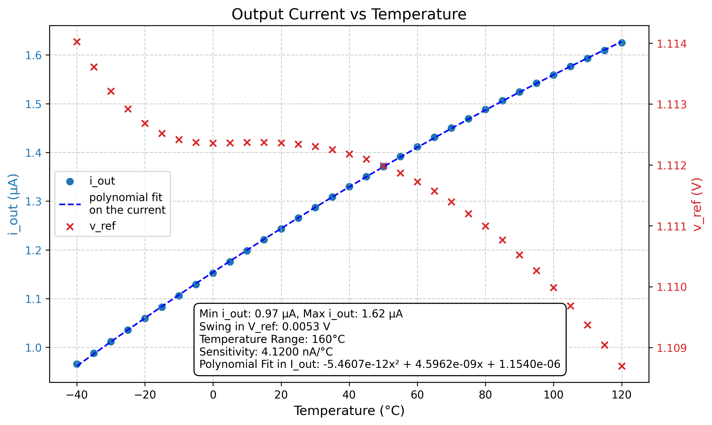

# Who
Group 05 (Manuel,Emilien,Amir,Fabrice)

# Why

This module creates an output current (almost linearly) dependent on the present temperatutre.

# How

Observe temperature-dependency in the diode equation, and use that to create a temperature dependent voltage based on the difference in the base-emitter voltage of two different BJTs.

# What

| What            |        Cell/Name |
| :-              |  :-:       |
| Schematic       | design/JNW_GR05_SKY130A/JNW_GR05.sch |
| Layout          | design/JNW_GR05_SKY130A/JNW_GR05.mag |

# Changelog/Plan

| Version | Status | Comment|
| :---| :---| :---|
|0.1.0 | :Approved: | Fulfills the criterions for milestone 01 |

# Signal interface

| Signal       | Direction | Domain  | Description                               |
| :---         | :---:     | :---:   | :---                                      |
| VDD_1V8         | Input     | VDD_1V8 | Main supply                              |
| VSS         | Input     | Ground  |                                           |
| PWRUP_1V8     | Input    | VDD_1V8 | Power up the circuit  (not implemented yet)                     |
|I_out | Output | I=f(T) | Temperature dependent output current |

# Key parameters

| Parameter           | Min     | Typ           | Max     | Unit  |
| :---                | :---:     | :---:           | :---:     | :---: |
| Technology          |         | Skywater 130 nm |         |       |
| AVDD                | 1.7    | 1.8           | 1.9    | V     |
| Temperature         | -40     | 27            | 125     | C     |

A output for a (take the word!) typical simulation is given by the following figure.
It shows the temperature-dependent output current which is fed into the capacitor on the right hand side
and the reference voltage used for the comparator on the right hand side.

Running for corners yields a similar but less consistent result (see below).
CAUTION: This is the first corner results, obtained on March 13. No steps taken yet to make it more consistent.
Output current:

Reference voltage:

# OTA Analysis

** Results for RT are:  **
| Parameter  | Value      | Unit           | Description               |
|------------|------------|----------------|---------------------------|
| f3db       | 175.57     | kHz            | 3 dB Bandwidth           |
| gm_db      | -16.309    | dB             | Gain Margin               |
| lf_gain    | 40.073     | dB             | Low-Frequency Gain        |
| pm_deg     | 67.513     | Degrees        | Phase Margin              |
| ug         | 17.257     | MHz            | Unity Gain Frequency      |

Most importantly, the OTA is stable and meets the typical 40 dB DC gain for two-stage systems.
Further, the parameters indicate a rather low 3dB bandwidth and low unity gain frequency.
In physical systems, temperature increases or decreasses with a (compared to the OTA paramters) large time constant, 
thus we see no need for adapting the amplifier design.

** Obtained bodeplot: **

