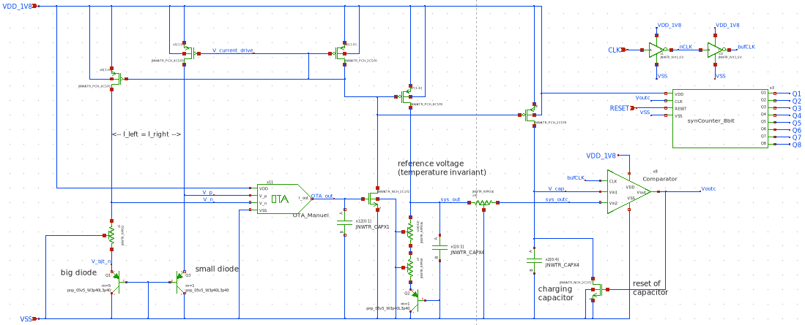

# About the digital output proportional to temperature
The idea of our implementation is to count how many times a capacitor charges and discharges within a certain period. To do this, the comparator checks if the capacitor's voltage is higher than a reference voltage. When this happens, the comparator output goes high, which then activates a transistor to discharge the capacitor. Thus, the output of the comparator is a pulse signal that goes high for (approximately) one clock cycle each time the capacitor voltage crosses the reference voltage.

A counter records these pulses. Counting how many times the capacitor charges and discharges gives more precision than just measuring how long it takes for one charge cycle. The longer we count, the higher the accuracy.

Currently, we count for 590.59 μs. Within this time, there is a difference of 160 pulses between the lowest temperature (-40°C) and the highest (120°C). This means each additional pulse corresponds to 1°C if the response is perfectly linear, leading to an accuracy of ±1°C.

A reset signal acting on the counter sets the measurement duration. In this case, it must be a pulse signal that activates every 590.59 μs. However, since our counter can only go up to 256, and the number of pulses can range from 295 (at -40°C) to 455 (at 120°C), an overflow will occur. This is not a problem because there will always be only one overflow, regardless of the temperature. One of the next steps would be buffering the digital output at the end of the conversion period, which lowers the timing requirements on the digital readout. In this case, the output will be available until the next (successful) conversion cycle is finished.

To determine the temperature, we will convert the counter’s (straight) binary output to a decimal number and apply an offset to get the correct temperature value.

# About the time-dependent current
The major steps are:
* Observe temperature-dependency in the diode equation
* Take two  Bipolar-Transistors (BJTs) with different cross-sectional area and make them diode-connected.
* Source (not necessarily identical) current through both BJTs, but have the ratio fixed. The current ratio is **must** not cancel with the the cross-sectional area ratio.
* Add a resistor in series to the wider BJT, the BJT remains connected to ground.
* Connect the top terminal of the resistor and the terminal of the BJT to the input of an Operational-Transconductance-Amplifier (OTA)
* Connect the output of the OTA to a Common-Source amplifier whose output current is mirrored back into the BJTs.

Due to the feedback, the inputs of the OTA are close to equal, and a temperature dependent voltage across the resistor is generated based on the difference in the base-emitter voltage of two different BJTs.
Thus, the current sourced into the BJTs is also linearly dependent in temperature - as desired.
The general structure is shown in this sketch:

# About the reference voltage:
The temperature-dependent current is mirrored into a resistor connected in series to another diode-connected BJT. The temperature dependency cancels or at least counteracts for a proper choice of the series resistance. Thus, a local temperature-invariant voltage is created which will be used as a reference on the comparator (see below). The voltage reference is also shown in the plot above.

# Key parameters

| Parameter           | Min     | Typ           | Max     | Unit  |
| :---                | :---:     | :---:           | :---:     | :---: |
| Technology          |         | Skywater 130 nm |         |       |
| AVDD                | 1.7    | 1.8           | 1.9    | V     |
| Average Supply Current             |  50   | 60         | 150   | uA     |
| Temperature         | -40     | 27            | 125     | C     |

A output for a (take the word!) typical simulation is given by the following figure.
It shows the temperature-dependent output current which is fed into the capacitor on the left hand side
and the reference voltage used for the comparator on the right hand side.

Running for corners yields a similar but less consistent result (see below).
CAUTION: This is the first corner results, obtained on March 13. No steps taken yet to make it more consistent.
Output current:

Reference voltage:

# About the counter:
Our objective is to count how many times the capacitor can charge within a given time period. To achieve this, we use a synchronous counter made of JK flip-flops.

In this counter, all flip-flops share the same clock signal, eliminating the delays found in asynchronous counters. The J and K inputs of each flip-flop are controlled by an AND gate, which takes the input and output of the previous flip-flop. This setup allows the counter to increment in binary.

Additionally, a reset input ensures that all flip-flops in the counter can be reset simultaneously.
The schematic of the 8 bits counter is shown in the figure below.

# For completeness: View of the entire Top-Level design

