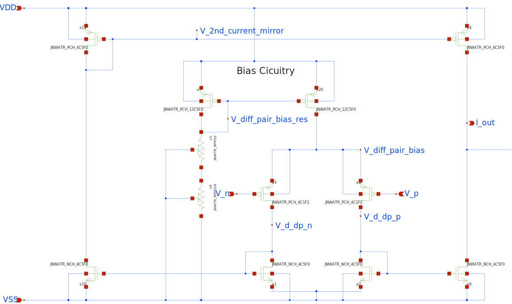

## About the OTA:
The OTA is used to force the terminal of the smaller BJT to be equal to the voltage on the terminal of the resistor connected in series to the bigger BJT.
In the schematic, these nodes are labeled v_p and v_n, respectively.

The OTA consists of a differential pair followed by a current-mirror stage.
Since the voltage at the OTA inputs is basically a diode voltage, the inputs are close to the threshold voltage of the NMOS. Thus, PMOSes are used for the input pair.
The figure below presents the OTA schematic. Below, a stability analysis of the OTA is used to check for a stable system.

## OTA Analysis

#### Results for RT are:
| Parameter  | Value      | Unit           | Description               |
|------------|------------|----------------|---------------------------|
| f3db       | 175.57     | kHz            | 3 dB Bandwidth           |
| gm_db      | -16.309    | dB             | Gain Margin               |
| lf_gain    | 40.073     | dB             | Low-Frequency Gain        |
| pm_deg     | 67.513     | Degrees        | Phase Margin              |
| ug         | 17.257     | MHz            | Unity Gain Frequency      |

Most importantly, the OTA is stable and meets the typical 40 dB DC gain for two-stage amplifiers.
Further, the parameters indicate a rather low 3dB bandwidth and low unity gain frequency.

In physical systems, temperature increases or decreasses with a (compared to the OTA parameters) large time constant, 
thus we see no need for adapting the amplifier design.

#### Obtained bodeplot:

