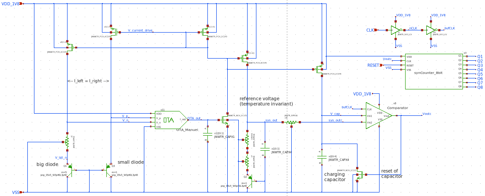

## About the time-dependent current
The major steps are:
* Observe temperature-dependency in the diode equation
* Take two  Bipolar-Transistors (BJTs) with different cross-sectional area and make them diode-connected.
* Source (not necessarily identical) current through both BJTs, but have the ratio fixed. The current ratio is **must** not cancel with the the cross-sectional area ratio.
* Add a resistor in series to the wider BJT, the BJT remains connected to ground.
* Connect the top terminal of the resistor and the terminal of the BJT to the input of an Operational-Transconductance-Amplifier (OTA)
* Connect the output of the OTA to a Common-Source amplifier whose output current is mirrored back into the BJTs.

Due to the feedback, the inputs of the OTA are close to equal, and a temperature dependent voltage across the resistor is generated based on the difference in the base-emitter voltage of two different BJTs.
Thus, the current sourced into the BJTs is also linearly dependent in temperature - as desired.
The general structure is shown in this sketch:

## About the reference voltage:
The temperature-dependent current is mirrored into a resistor connected in series to another diode-connected BJT. The temperature dependency cancels or at least counteracts for a proper choice of the series resistance. Thus, a local temperature-invariant voltage is created which will be used as a reference on the comparator (see below). The voltage reference is also shown in the plot above.

## About the counter:
Our objective is to count how many times the capacitor can charge within a given time period. To achieve this, we use a synchronous counter made of JK flip-flops.

In this counter, all flip-flops share the same clock signal, eliminating the delays found in asynchronous counters. The J and K inputs of each flip-flop are controlled by an AND gate, which takes the input and output of the previous flip-flop. This setup allows the counter to increment in binary.

Additionally, a reset input ensures that all flip-flops in the counter can be reset simultaneously.
The schematic of the 8 bits counter is shown in the figure below.

## For completeness: View of the entire Top-Level design

